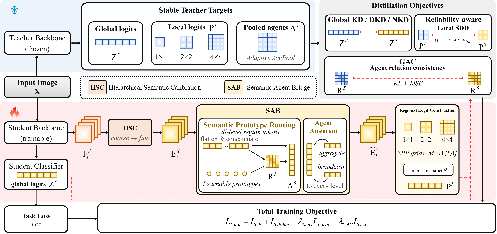

# RSM

## Reliability-Aware Semantic Mediation for Scale-Decoupled Knowledge Distillation

Official PyTorch implementation of **Reliability-Aware Semantic Mediation (RSM)**.

RSM is a training-time extension of Scale-Decoupled Distillation (SDD) for image classification. It preserves the architecture-agnostic logit interface of response-based knowledge distillation while addressing two limitations of fixed-grid regional supervision:

1. regional targets assigned to the same SDD group can have very different reliability; and
2. constructing every regional logit from the penultimate feature leaves earlier student evidence unused.

RSM introduces a continuous teacher-confidence factor, a student-only **Hierarchical Semantic Calibration (HSC) - Semantic Agent Bridge (SAB)** pathway, and **Global Agent Consistency (GAC)** for channel-agnostic relation transfer. Every mediation component is used only during training; the deployed student keeps its original architecture and computation graph.

<p align="center">
  
</p>

## Abstract

Logit-based knowledge distillation transfers class-level predictions through a common output space, but image-level logits discard the spatial evidence behind each decision. SDD recovers local evidence by applying the original classifier to fixed-grid regional descriptors and assigning binary consistent/complementary weights. RSM refines this regional supervision in two ways. First, it continuously modulates every teacher region according to predictive confidence. Second, it calibrates and mediates multi-level student evidence before regional classification. A fixed-size agent relation graph further transfers geometry without requiring teacher and student feature channels to match.

Across CIFAR-100, ImageNet-1K, and CUB-200-2011 with KD, DKD, and NKD objectives, RSM improves **50 of 51 matched top-1 comparisons**, with a median gain of **0.91 percentage points** over the corresponding SDD variants.

## Method

### Asymmetric teacher-student design

The teacher is pretrained, frozen, kept in evaluation mode, and evaluated under stop-gradient. It provides:

- image-level logits;
- fixed-grid regional logits from its penultimate spatial feature; and
- ordered pooled descriptors used to construct the teacher relation graph.

The teacher contains no trainable HSC, routing, or SAB module. Representation learning is confined to the student branch, which prevents the target space from drifting during training.

### Hierarchical Semantic Calibration

HSC selects multiple student stages, projects them to a common width, and calibrates them from deep to shallow. At each higher-resolution level, an adaptive semantic fusion unit combines local detail with the resized calibrated output of the next deeper stage. A learnable residual scale introduces the fused context without replacing the original local representation.

This produces a semantically strengthened hierarchy while retaining the spatial detail needed for regional classification.

### Semantic Agent Bridge

SAB connects distant regions and non-adjacent feature levels through an efficient region-agent-region path:

1. calibrated features from all selected levels are flattened and concatenated into one token bank;
2. learned routing anchors summarize the token bank into image-conditioned semantic agents;
3. region-to-agent attention refines the agents with evidence from every level; and
4. agent-to-region attention broadcasts the shared context back to every selected level.

The same compact agent set is also used to construct the student relation graph for GAC. With `A` agents and `N` regional tokens, the mediated interaction scales with `A x N` rather than the `N x N` affinity of dense all-token self-attention.

### Reliability-aware Local SDD

RSM retains SDD's original consistent/complementary regional factor and multiplies it by a continuous reliability term derived from the teacher distribution:

```text
w_region = w_reliability * w_SDD
```

A uniform teacher distribution maps to the minimum reliability weight, while a concentrated distribution approaches one. This quantity measures predictive concentration; it is not an objectness or foreground score.

Regional logits are produced by adaptive pooling and the original classifier. RSM does not introduce a separate regional classification head.

### Global Agent Consistency

GAC aligns teacher and student agent-relation geometry through a fixed-size `A x A` interface. Because the comparison is performed between normalized relation graphs, teacher and student may have different feature channels and architectures.

### Training objective

The final objective in the paper is:

```text
L_total = L_CE + L_Global + lambda_SDD * L_Local + lambda_GAC * L_GAC
```

`L_Global` and the regional divergence inside `L_Local` use the selected base response objective. This gives the three paper variants:

| Paper variant | Base objective |
|---|---|
| RSM-KD | KD |
| RSM-DKD | DKD |
| RSM-NKD | NKD |

## Paper-to-Code Map

Some source symbols and configuration paths predate the final RSM paper terminology. They are retained for checkpoint and experiment compatibility.

| Paper component | Source file | Current internal symbol |
|---|---|---|
| Complete RSM training-time distiller | [`mdistiller/distillers/pama_sdd.py`](mdistiller/distillers/pama_sdd.py) | `PAMASDD` |
| Hierarchical Semantic Calibration | [`mdistiller/modules/apf.py`](mdistiller/modules/apf.py) | `APF`, `APFGate` |
| Semantic Agent Bridge | [`mdistiller/modules/csam.py`](mdistiller/modules/csam.py) | `CSAM` |
| Fixed-grid regional logits | [`mdistiller/modules/spp.py`](mdistiller/modules/spp.py) | `spp_logits` |
| Reliability-aware Local SDD | [`mdistiller/distillers/sdd.py`](mdistiller/distillers/sdd.py) | `local_kd_loss` |
| RSM-KD / RSM-DKD / RSM-NKD registry | [`mdistiller/distillers/__init__.py`](mdistiller/distillers/__init__.py) | `PAMA_KD`, `PAMA_DKD`, `PAMA_NKD` |

The `PAMA_*` names above are implementation identifiers only; the method reported in the paper and presented by this repository is **RSM**.

## Main Results

RSM is evaluated on CIFAR-100, ImageNet-1K, and CUB-200-2011 across convolutional teacher-student pairs and three response objectives.

| Dataset | Representative result | Improvement over matched SDD |
|---|---:|---:|
| CIFAR-100, ResNet32x4 -> ShuffleNetV1, RSM-DKD | 79.18 top-1 | +1.88 |
| ImageNet-1K, ResNet50 -> MobileNetV1, RSM-DKD | 73.60 top-1 / 91.83 top-5 | +0.52 / +0.74 |
| CUB-200-2011, VGG13 -> MobileNetV2, RSM-NKD | 69.09 top-1 | +4.46 |

In the controlled three-seed CIFAR-100 ablation:

| Teacher -> Student | SD-DKD | Full RSM-DKD |
|---|---:|---:|
| ResNet32x4 -> ResNet8x4 | 77.46 +/- 0.12 | **78.55 +/- 0.10** |
| ResNet32x4 -> ShuffleNetV1 | 77.30 +/- 0.11 | **79.18 +/- 0.08** |

HSC, SAB, reliability-aware weighting, and GAC each contribute to the final result, and the complete model performs best in both controlled settings.

## Default Paper Settings

Unless an architecture-specific configuration states otherwise, the paper uses:

| Setting | Value |
|---|---:|
| Regional grids | `{1, 2, 4}` |
| Number of agents | `16` |
| Shared embedding width | `256` |
| Attention heads | `4` |
| Reliability floor | `0.2` |
| Reliability exponent | `1.0` |
| SDD consistent/complementary weights | `1 / 2` |
| Local SDD coefficient | `1.0` |
| GAC coefficient | `0.5` |
| Distillation warmup | `30 epochs` |
| HSC residual-scale initialization | `0.5` |
| SAB LayerScale initialization | `1e-4` |

KD and DKD use temperature `4`; DKD uses `alpha=1` and `beta=8`. NKD uses temperature `1` and `gamma=1.5`. Semantic prototype routing initializes the student agents.

## Installation

Python 3.10 and PyTorch 2.x are recommended.

```bash
conda create -n rsm-sdd python=3.10 -y
conda activate rsm-sdd

# Install the PyTorch build matching your CUDA version first.
# Example for CUDA 12.1:
pip install torch torchvision --index-url https://download.pytorch.org/whl/cu121

pip install -r requirements.txt
pip install -e .
```

Verify the installation:

```bash
python tools/verify_install.py
python -m pytest -q
```

## Data and Teacher Checkpoints

Datasets, pretrained teachers, checkpoints, and experiment outputs are not included in the repository.

```text
data/
|-- cifar100/
|-- imagenet/
`-- CUB_200_2011/
```

Set `MODEL.TEACHER_CKPT` in the selected YAML file before training. Teachers must be pretrained on the corresponding target training split. `--allow-random-teacher` is provided only for debugging and must not be used for reported accuracy.

## Training

The training entry point is `train.py`:

```bash
python train.py \
  --cfg <path-to-config.yaml> \
  --data-root <path-to-dataset> \
  --output ./runs/<experiment-name> \
  --gpu 0
```

Example using an existing CIFAR-100 configuration:

```bash
python train.py \
  --cfg configs/cifar100/pama_dkd/res32x4_mv2_spr.yaml \
  --data-root ./data/cifar100 \
  --output ./runs/cifar100_res32x4_mv2_rsm_dkd \
  --gpu 0
```

The current YAML directories and distiller identifiers retain the pre-publication `pama_*` names. For the final paper objective, use the RSM settings listed above and disable legacy auxiliary losses that do not appear in the paper objective.

Minimal fake-data smoke run:

```bash
python train.py \
  --cfg configs/cifar100/pama_dkd/res32x4_mv2_spr.yaml \
  --debug-fake-data \
  --allow-random-teacher \
  --epochs 1 \
  --output ./runs/debug_fake
```

## Repository Layout

```text
RSM-SDD/
|-- configs/                 # Dataset, objective, and teacher-student settings
|-- mdistiller/
|   |-- dataset/             # CIFAR-100, ImageNet-1K, and CUB-200-2011 loaders
|   |-- distillers/          # RSM and response-distillation objectives
|   |-- engine/              # Configuration, training, and evaluation utilities
|   |-- models/              # Teacher and student backbones
|   `-- modules/             # HSC/SAB implementation and regional prediction
|-- scripts/                 # Example launch scripts
|-- tests/                   # Smoke and path tests
|-- tools/                   # Installation, benchmarking, and analysis utilities
|-- train.py                 # Main training entry point
`-- requirements.txt
```

## Citation

If this work is useful in your research, please cite:

```bibtex
@misc{long2026rsm,
  title  = {Reliability-Aware Semantic Mediation for Scale-Decoupled Knowledge Distillation},
  author = {Long, Shiyu},
  year   = {2026},
  note   = {Preprint}
}
```

## Acknowledgements

This repository follows an MDistiller-style code organization and builds on Scale-Decoupled Distillation. SAB also adopts the general region-agent-region interaction principle from Agent Attention for its training-time semantic mediation role. Please cite the corresponding prior work when using those components.
