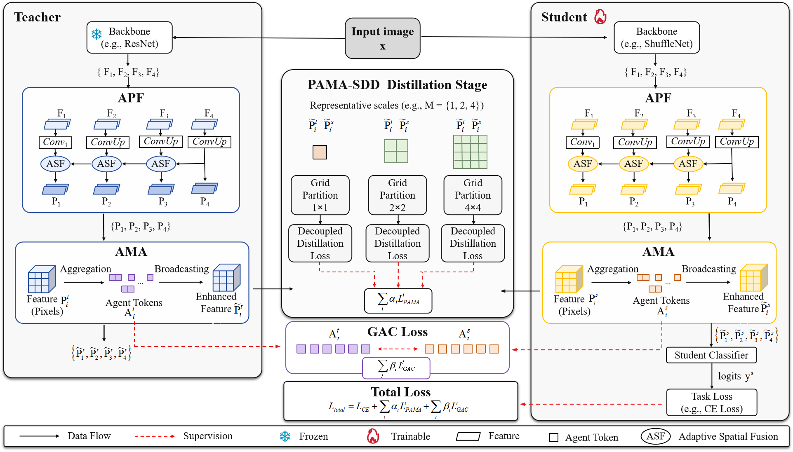

# PAMA-SDD

**Pyramid and Agent-Mediated Attention for Scale-Decoupled Knowledge Distillation**

PAMA-SDD is a classification-oriented knowledge distillation framework that improves scale-decoupled distillation with pyramid feature calibration and agent-mediated global alignment. It keeps the fine-grained local supervision of SDD, while reducing semantic fragmentation from fixed grid partitions.

<p align="center">
  
</p>

## Highlights

- **Local-global distillation.** Region-wise local logits are distilled at representative scales such as `M = {1, 2, 4}`, while global semantic consistency is preserved through agent tokens.
- **APF: Asymptotic Pyramid Fusion.** Adjacent feature levels are progressively fused and calibrated with Adaptive Spatial Fusion before local partitioning.
- **AMA: Agent-Mediated Attention.** Compact agent tokens aggregate context from region features and broadcast global semantics back to local features with low overhead.
- **GAC: Global Agent Consistency.** Teacher and student agent-token representations are explicitly aligned to transfer global semantic organization.
- **No deployment overhead.** APF, AMA, PAMA losses, and GAC are used only during training; inference keeps the original compact student network.

## Method Overview

Given an input image, a frozen teacher and a trainable student extract hierarchical features `{F1, F2, F3, F4}`. PAMA-SDD first applies APF to produce calibrated pyramid features `{P1, P2, P3, P4}`. AMA then uses agent tokens as semantic mediators: local feature tokens are aggregated into agents, and the agent-level context is broadcast back to enhanced local features.

The enhanced teacher and student features are partitioned into multiple grids, for example `1x1`, `2x2`, and `4x4`, and local decoupled distillation losses are computed at each scale. In parallel, GAC aligns teacher and student agent tokens. The training objective combines task classification, scale-wise PAMA distillation, and agent consistency:

```text
L_total = L_CE + sum_i alpha_i * L_PAMA_i + sum_i beta_i * L_GAC_i
```

This repository includes PAMA variants built on three logit objectives:

- `PAMA_KD`
- `PAMA_DKD`
- `PAMA_NKD`

## Repository Layout

```text
configs/                 Experiment configs for CIFAR-100, ImageNet-1K, and CUB-200-2011
mdistiller/              MDistiller-compatible datasets, models, distillers, modules, and training utilities
scripts/                 Example training scripts
tests/                   Smoke tests and dataset-path checks
tools/                   Utility scripts
train.py                 Main training entry point
test.py                  Evaluation entry point
README_zh.md             Chinese reproduction notes and command reference
```

Large local artifacts are intentionally excluded from Git:

```text
data/
runs/
weights/
*.log
*.pth
*.pt
*.ckpt
*.tar
*.tar.gz
*.zip
```

## Installation

Create an environment and install dependencies:

```bash
conda create -n pama-sdd python=3.10 -y
conda activate pama-sdd

# Install a PyTorch build suitable for your CUDA/CPU environment first.
# Example for CUDA 12.1:
pip install torch torchvision --index-url https://download.pytorch.org/whl/cu121

pip install -r requirements.txt
pip install -e .
```

Quick checks:

```bash
python tools/verify_install.py
pytest
```

## Data Preparation

Place datasets under `data/` or pass a custom path with `--data-root`.

```text
data/cifar100
data/imagenet
data/CUB_200_2011
```

For CUB-200-2011, one commonly used mirror is CaltechDATA:

```bash
mkdir -p data
cd data
wget -O CUB_200_2011.tgz "https://data.caltech.edu/records/65de6-vp158/files/CUB_200_2011.tgz?download=1"
tar -xzf CUB_200_2011.tgz
cd ..
```

## Teacher Checkpoints

Final distillation accuracy requires pretrained teacher checkpoints. The configs point to paths such as:

```text
save/models/resnet32x4_vanilla/ckpt_epoch_240.pth
save/models/wrn_40_2_vanilla/ckpt_epoch_240.pth
save/models/resnet50_vanilla/ckpt_epoch_240.pth
save/models/vgg13_vanilla/ckpt_epoch_240.pth
save/imagenet/resnet34/ckpt.pth
save/imagenet/resnet50/ckpt.pth
save/cub200/resnet32x4/ckpt.pth
save/cub200/vgg13/ckpt.pth
save/cub200/resnet50/ckpt.pth
```

If your checkpoints are stored elsewhere, update `MODEL.TEACHER_CKPT` in the corresponding YAML config. The `--allow-random-teacher` flag is only for debugging and should not be used for final reported accuracy.

## Quick Start

Train PAMA-DKD on CIFAR-100 with `ResNet32x4 -> MobileNetV2`:

```bash
python train.py \
  --cfg configs/cifar100/pama_dkd/res32x4_mv2.yaml \
  --data-root ./data/cifar100 \
  --output ./runs/cifar100_res32x4_mv2_pama_dkd \
  --gpu 0
```

Debug with fake data and one epoch:

```bash
python train.py \
  --cfg configs/cifar100/pama_dkd/res32x4_mv2.yaml \
  --debug-fake-data \
  --allow-random-teacher \
  --epochs 1 \
  --output ./runs/debug_fake
```

Train ImageNet-1K:

```bash
python train.py \
  --cfg configs/imagenet/r34_r18/pama_dkd.yaml \
  --data-root ./data/imagenet \
  --output ./runs/imagenet_r34_r18_pama_dkd \
  --gpu 0
```

Train CUB-200-2011:

```bash
python train.py \
  --cfg configs/cub200/vgg13_mv2/pama_nkd.yaml \
  --data-root ./data/CUB_200_2011 \
  --output ./runs/cub200_vgg13_mv2_pama_nkd \
  --gpu 0
```

## Config Guide

Use the method folder to choose the base objective:

```text
configs/cifar100/pama_kd/*.yaml
configs/cifar100/pama_dkd/*.yaml
configs/cifar100/pama_nkd/*.yaml
configs/imagenet/*/pama_kd.yaml
configs/imagenet/*/pama_dkd.yaml
configs/imagenet/*/pama_nkd.yaml
configs/cub200/*/pama_kd.yaml
configs/cub200/*/pama_dkd.yaml
configs/cub200/*/pama_nkd.yaml
```

Supported teacher-student pairs include:

| Dataset | Teacher -> Student | Config pattern |
|---|---|---|
| CIFAR-100 | ResNet32x4 -> MobileNetV2 | `configs/cifar100/<method>/res32x4_mv2.yaml` |
| CIFAR-100 | WRN-40-2 -> VGG8 | `configs/cifar100/<method>/wrn40_2_vgg8.yaml` |
| CIFAR-100 | WRN-40-2 -> MobileNetV2 | `configs/cifar100/<method>/wrn40_2_mv2.yaml` |
| CIFAR-100 | ResNet50 -> ShuffleNetV1 | `configs/cifar100/<method>/r50_shuv1.yaml` |
| CIFAR-100 | ResNet32x4 -> ShuffleNetV1 | `configs/cifar100/<method>/res32x4_shuv1.yaml` |
| CIFAR-100 | WRN-40-2 -> ShuffleNetV1 | `configs/cifar100/<method>/wrn40_2_shuv1.yaml` |
| CIFAR-100 | ResNet50 -> MobileNetV2 | `configs/cifar100/<method>/r50_mv2.yaml` |
| CIFAR-100 | VGG13 -> MobileNetV2 | `configs/cifar100/<method>/vgg13_mv2.yaml` |
| CIFAR-100 | ResNet32x4 -> ShuffleNetV2 | `configs/cifar100/<method>/res32x4_shuv2.yaml` |
| CIFAR-100 | ResNet50 -> VGG8 | `configs/cifar100/<method>/r50_vgg8.yaml` |
| ImageNet-1K | ResNet34 -> ResNet18 | `configs/imagenet/r34_r18/pama_*.yaml` |
| ImageNet-1K | ResNet50 -> MobileNetV2 | `configs/imagenet/r50_mv2/pama_*.yaml` |
| CUB-200-2011 | ResNet32x4 -> MobileNetV2 | `configs/cub200/res32x4_mv2/pama_*.yaml` |
| CUB-200-2011 | ResNet32x4 -> ShuffleNetV1 | `configs/cub200/res32x4_shuv1/pama_*.yaml` |
| CUB-200-2011 | VGG13 -> MobileNetV2 | `configs/cub200/vgg13_mv2/pama_*.yaml` |
| CUB-200-2011 | VGG13 -> VGG8 | `configs/cub200/vgg13_vgg8/pama_*.yaml` |
| CUB-200-2011 | ResNet50 -> ShuffleNetV1 | `configs/cub200/resnet50_shuv1/pama_*.yaml` |

## Reported Results

The following numbers are from the local paper draft used to prepare this repository. Values in parentheses are absolute improvements over the corresponding scale-decoupled baseline (`SD-KD`, `SD-DKD`, or `SD-NKD`).

### CIFAR-100 Top-1 Accuracy

| Teacher -> Student | Best PAMA variant | Top-1 |
|---|---:|---:|
| ResNet32x4 -> MobileNetV2 | PAMA-DKD | 71.10 (+1.02) |
| WRN-40-2 -> VGG8 | PAMA-KD | 75.22 (+0.78) |
| WRN-40-2 -> MobileNetV2 | PAMA-NKD | 71.49 (+1.45) |
| ResNet50 -> ShuffleNetV1 | PAMA-DKD | 79.70 (+1.59) |
| ResNet32x4 -> ShuffleNetV1 | PAMA-DKD | 79.18 (+1.88) |
| WRN-40-2 -> ShuffleNetV1 | PAMA-NKD | 77.61 (+0.80) |
| ResNet50 -> MobileNetV2 | PAMA-DKD | 71.80 (+0.44) |
| VGG13 -> MobileNetV2 | PAMA-DKD | 71.22 (+0.97) |
| ResNet32x4 -> ShuffleNetV2 | PAMA-DKD | 78.50 (+0.45) |
| ResNet50 -> VGG8 | PAMA-DKD | 76.45 (+0.59) |

### ImageNet-1K Accuracy

| Teacher -> Student | Variant | Top-1 | Top-5 |
|---|---|---:|---:|
| ResNet34 -> ResNet18 | PAMA-KD | 71.66 (+0.22) | 90.48 (+0.43) |
| ResNet34 -> ResNet18 | PAMA-DKD | 72.35 (+0.33) | 91.74 (+0.53) |
| ResNet34 -> ResNet18 | PAMA-NKD | 72.57 (+0.24) | 91.42 (+0.11) |
| ResNet50 -> MobileNetV2 | PAMA-KD | 72.69 (+0.45) | 91.27 (+0.56) |
| ResNet50 -> MobileNetV2 | PAMA-DKD | 73.60 (+0.52) | 91.83 (+0.74) |
| ResNet50 -> MobileNetV2 | PAMA-NKD | 73.44 (+0.32) | 91.73 (+0.62) |

### CUB-200-2011 Top-1 Accuracy

| Teacher -> Student | Best PAMA variant | Top-1 |
|---|---:|---:|
| ResNet32x4 -> MobileNetV2 | PAMA-NKD | 66.69 (+4.00) |
| ResNet32x4 -> ShuffleNetV1 | PAMA-DKD | 67.05 (+1.47) |
| VGG13 -> MobileNetV2 | PAMA-NKD | 69.09 (+4.46) |
| VGG13 -> VGG8 | PAMA-NKD | 69.23 (+0.86) |
| ResNet50 -> ShuffleNetV1 | PAMA-DKD | 62.50 (+1.84) |

## Useful Scripts

```bash
bash scripts/train_cifar100_pama_dkd.sh
bash scripts/train_imagenet_pama_dkd.sh
bash scripts/train_cub200_pama_dkd.sh
```

For long runs, redirect logs outside Git-tracked files:

```bash
mkdir -p logs
nohup python train.py \
  --cfg configs/cifar100/pama_dkd/res32x4_mv2.yaml \
  --data-root ./data/cifar100 \
  --output ./runs/cifar100_res32x4_mv2_pama_dkd \
  --gpu 0 \
  > logs/cifar100_res32x4_mv2_pama_dkd.log 2>&1 &
```

## Notes

- `runs/`, checkpoints, datasets, and logs are ignored on purpose because they are too large for a normal GitHub code repository.
- CIFAR-100 configs that use `ResNet50` require a compatible CIFAR-style ResNet50 implementation and checkpoint.
- `README_zh.md` contains a more command-oriented Chinese reproduction note.

## Citation

If you find this repository useful, please cite the paper draft:

```bibtex
@misc{long2026pamasdd,
  title  = {PAMA-SDD: Pyramid and Agent-Mediated Attention for Scale-Decoupled Knowledge Distillation},
  author = {Long, Shiyu},
  year   = {2026},
  note   = {Preprint}
}
```

## Acknowledgement

This project follows an MDistiller-compatible organization and builds on the idea of scale-decoupled distillation for fine-grained local logit supervision.
